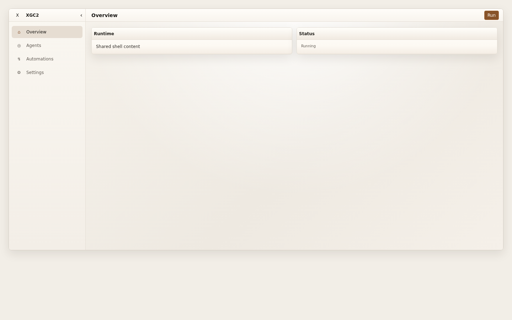
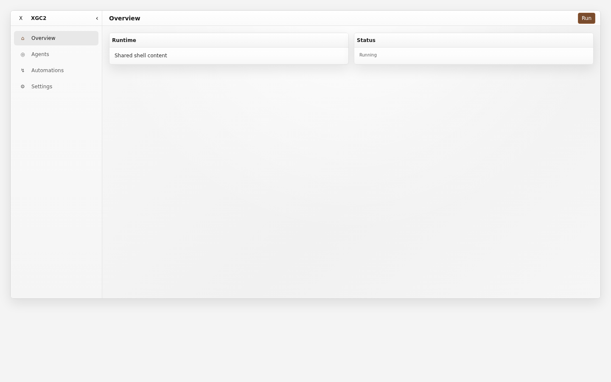

# Neutral-white light correction evidence

Historical note: tokens `0.9.0` restored the original cool blue-grey light
foundation and replaced the achromatic gate with a not-warm contract. The
tables below remain the `0.15.3` beige-to-neutral correction record.

This review compares the published `v0.15.2` application-shell story at
`f77e6366cf310ab38c05b8b17f8afe5e3a5e00ab` with the `0.15.3` candidate. Both
screenshots use Google Chrome, a `1440 × 900` viewport, device scale factor `1`,
the same Storybook story, and the explicit `light` global.

| Published `v0.15.2` | `0.15.3` candidate |
| --- | --- |
|  |  |

## Foundation token proof

| Role | `v0.15.2` | `0.15.3` candidate |
| --- | --- | --- |
| Application workbench | `#f2eee7` | `#f4f4f4` |
| Chrome | `#fffdf9` | `#ffffff` |
| Sidebar | `#f7f3ec` | `#f8f8f8` |
| Forward surface | `#fffdf9` | `#ffffff` |
| Code surface | `#f0eae1` | `#f2f2f2` |
| Spatial canvas | `#ebe5dc` | `#ececec` |
| Standard border | `#d5cdc3` | `#d4d4d4` |
| Body text | `#302d29` | `#2d2d2d` |

Every candidate light foundation literal uses equal RGB channels. The validator
allows at most two RGB levels of drift so rounding cannot become a new warm or
cool palette. Accent, semantic, chart-data, and syntax colors are outside that
achromatic foundation gate and remain available only for their named roles.

## Measured contrast

| Pair | Ratio | Required |
| --- | ---: | ---: |
| Body text / application | `12.52:1` | `7:1` |
| Body text / control | `13.77:1` | `7:1` |
| Muted text / surface | `6.58:1` | `4.5:1` |
| Faint text / surface | `4.95:1` | `4.5:1` |
| Disabled text / surface | `3.69:1` | `3:1` |
| Inverse text / primary control | `7.24:1` | `4.5:1` |
| Strong border / control | `3.11:1` | `3:1` |
| Focus border / control | `6.04:1` | `3:1` |
| Selection / canvas | `6.25:1` | `3:1` |
| Terminal text / terminal background | `12.76:1` | `7:1` |
| Terminal metadata / terminal background | `5.02:1` | `4.5:1` |
| Code comment / code background | `4.98:1` | `4.5:1` |

The executable token validator checks these pairs and every code and terminal
syntax role in both skins.

## Dark zero-drift proof

The complete dark selector block is `3,696` bytes in both the published
`v0.15.2` source and this candidate. Both files have SHA-256
`849b10b91bafd1d9088bc4582cceb3d91051e5c29555b8b17c1d2eeb136a2f4a`
and compare byte-for-byte equal. Independently rendered dark application-shell
screenshots also compare byte-for-byte equal, both with SHA-256
`484fc88dba1520cd4586a187432a406f4d70e63fde4d2471e45fcb193d10dbf4`.

No release tag or asset is created by this change.
